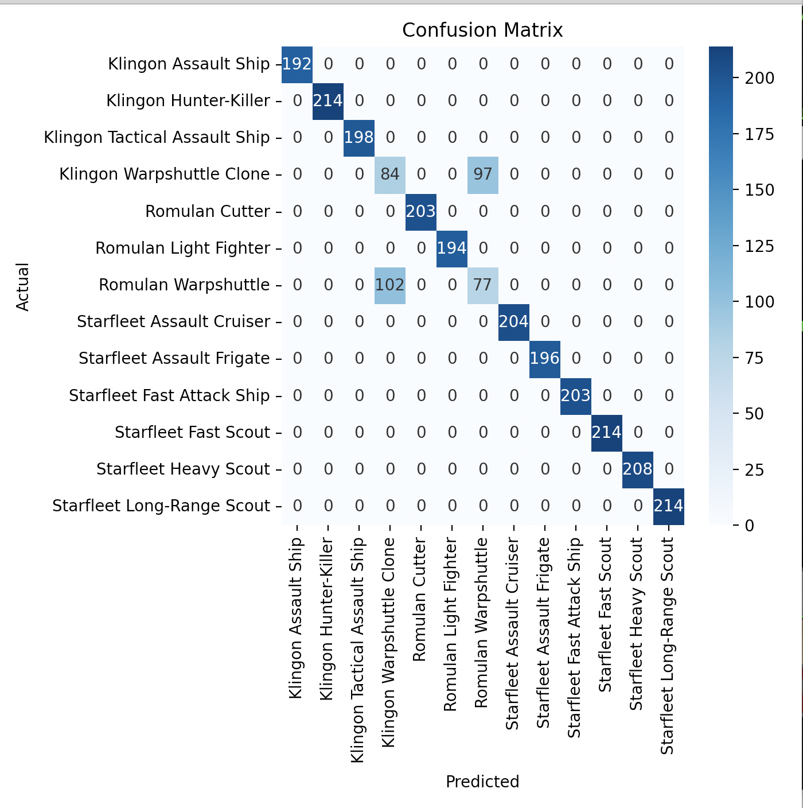

# Intro to Machine Learning

The following examples briefly introduce machine learning algorithms and their ability to classify data based on a set of features.

## Examples

1. [Training and Testing Data](#example-1)
2. [Determining Confusion Between Labels](#example-2)
3. [Calculating Feature Importance](#example-3)
4. [Realtime Prediction](#example-4)

## 1. Reading in data and classifying {#example-1}

First, lets make some data using a [script](ex1-model-works/make-data.py). The data will describe 24 unique measurements for the following types of twelve spaceships. 

```python
ships.append('Starfleet Assault Cruiser')
ships.append('Starfleet Assault Frigate')
ships.append('Starfleet Fast Scout')
ships.append('Starfleet Heavy Scout')
ships.append('Starfleet Long-Range Scout')
ships.append('Starfleet Fast Attack Ship')
ships.append('Klingon Assault Ship')
ships.append('Klingon Tactical Assault Ship')
ships.append('Klingon Hunter-Killer')
ships.append('Romulan Cutter')
ships.append('Romulan Light Fighter')
ships.append('Romulan Warpshuttle')
```

Each column of data will be a random float between two specific bounds for that type of ship. 

```
for i in range(0, len(ships)):
    ships_stats = []
    for j in range(0, TOTAL_STATS):
        v = uniform(0.0, 100.0)
        z = uniform(0.0, 100.0)*v
        x = round(random()*z, 2)
        y = round(x+random()*z, 2)
        ships_stats.append([x, y])
    stats[i] = ships_stats
```

So a Romulan Warpshuttles first statistic appears to be between 2000-3100. 

```
cat data.csv| grep War | head -5 | awk {'print $1'}
2015.29,
2263.17,
2607.89,
3454.66,
2075.22,
```

In contrast, the first static for a Klingon Hunter Killer appears to be between 40-50

```
cat data.csv| grep Killer | head -5 | awk {'print $1'}
54.25,
67.45,
58.01,
57.51,
43.77,
```

Using all 24 statistics, we can attempt to classify a set of features to the label for that ship.

First, we will read in the data. The features must be stored as a numpy array.

```python
from pwn import *
import pandas as pd
from sklearn.ensemble import RandomForestClassifier
from sklearn.model_selection import train_test_split
import numpy as np

features  = np.genfromtxt('data.csv', delimiter=',' , dtype=float)[:,:24]
labels    = np.genfromtxt('data.csv', delimiter=',' , dtype=str)[:,-1]

```

Next, we will build a model. For this, we will use a [RandomForestClassifier](https://scikit-learn.org/stable/modules/generated/sklearn.ensemble.RandomForestClassifier.html) thats a fairly generic model. It deals well with data that is both numerical and categorical. [Choosing the right estimator](https://scikit-learn.org/stable/tutorial/machine_learning_map/index.html) involves a lot of understanding of your data (how much you have, what it represents, and running preliminary experiments.)

Further, we can split the data into 80% training data and 20% testing data using the [train_test_split](https://scikit-learn.org/stable/modules/generated/sklearn.model_selection.train_test_split.html) function.

```python
training_fetures, testing_fetures, training_labels, testing_labels = train_test_split(features,labels, test_size=0.2, random_state=42)

clf = RandomForestClassifier()
clf.fit(training_fetures, training_labels)
```

Afterwards, we can [score](https://scikit-learn.org/stable/modules/model_evaluation.html) the testing data to see how it gets predicted (since we have the correct labels for it.) There are a lot of valuable statistics for scoring models [including accuracy, recall, f1, balanced_accuracy](https://scikit-learn.org/stable/modules/model_evaluation.html#common-cases-predefined-values). But for right now, lets stick with accuracy.

```python
test_score=clf.score(testing_fetures, testing_labels)

print("Testing accuracy:", test_score)
```


Running our [full script](ex1-model-works/build-model.py), we see that all the elements are predicted with 100% certainity.

```
python3 build-model.py 
Testing accuracy: 1.0
```

## 2. Determining Confusion Between Labels {#example-2}

Ok, thats obviously the ideal case since we generated perfect data. Lets go ahead and introduce some confusion between two different types of ships. Lets make a ``Klingon Clone`` of the ``Romulan Warpshuttle``.

```
ships.append('Klingon Warpshuttle Clone')

... <snipped> ...
        if ('Clone' in ships_labels[i]):
            # ensure the clone gets the same statistics as the warpshuttle
            rand_stat.append(round(uniform(stats[i-1][j][0], stats[i-1][j][1]), 2)) 
 
...
```

Now the ``Klingon Clone`` and ``Romulan Warpshupple`` should have the same statistics, meaning that they would incorrectly get classified as each other.
Testing our model, we see that the algorithm is less accurate because of the confusion.

```
python3 build-model.py 
Testing accuracy: 0.9234615384615384
```

A [confusion matrix](https://scikit-learn.org/stable/modules/generated/sklearn.metrics.confusion_matrix.html) can help explain to us which ships are getting incorrectly classified. We will add some conde to build one.

```
unique_labels = np.unique(labels)

prediction_labels = clf.predict(testing_features)
cm = confusion_matrix(testing_labels, prediction_labels)
plt.figure(figsize=(7, 7))
sns.heatmap(cm, annot=True, fmt='d', cmap='Blues',xticklabels=unique_labels, yticklabels=unique_labels)
plt.xlabel('Predicted')
plt.ylabel('Actual')
plt.title('Confusion Matrix')
plt.tight_layout()
plt.show()
```

This produces the following confusion matrix using a [seaborn heatmap](https://seaborn.pydata.org/generated/seaborn.heatmap.html). Look at the X-axis and Y-axis to see how the ships are getting classified. The diagonal across the confusion matrix represents ships that are classified correctly. However, notice how the Romulan Warpshuttle and Klingon clone are getting incorrectly classified as each other. 97 of the ``Klingon Warpshuttle Clones`` are getting classified as the actual ``Romulan Warpshuttles.``



## 3. Calculating Feature Importance {#example-3}

The next thing we can do is understand the weighting for each statistic that the model uses to classify.

Lets rewrite our build script to destroy three of the statistics by making sure they are the same across all types of ships.

```python
    # make the first three stats worthless
    ships_stats[0]=[1,2]
    ships_stats[1]=[1,2]
    ships_stats[2]=[1,2]
```

Now after testing the accuracy, lets try to understand which statistics factor the most into the models decisions. To do that, we will ask the model to provide us the [feature_importances](https://scikit-learn.org/stable/auto_examples/ensemble/plot_forest_importances.html).

```
print("Testing accuracy:", test_score)

importances = clf.feature_importances_

# Displaying feature importance for each column
for i, importance in enumerate(importances):
    print(f"Column #{i+1}: Feature Importance: {importance}")
```

Notice that the model is smart enough to throw out the first three features that we corrupted and not use them.

```
 python3 build-model.py 
Testing accuracy: 1.0
Column #1: Feature Importance: 0.0
Column #2: Feature Importance: 0.0
Column #3: Feature Importance: 0.0
Column #4: Feature Importance: 0.028757946810958585
Column #5: Feature Importance: 0.02444626952335422
Column #6: Feature Importance: 0.07567594348028257
Column #7: Feature Importance: 0.05804659617281969
Column #8: Feature Importance: 0.04230209395842324
Column #9: Feature Importance: 0.046930438966088325
Column #10: Feature Importance: 0.05842701965905788
Column #11: Feature Importance: 0.05334035588127395
Column #12: Feature Importance: 0.05297506316543128
Column #13: Feature Importance: 0.026091764895552202
Column #14: Feature Importance: 0.02825785109764585
Column #15: Feature Importance: 0.030926148775787688
Column #16: Feature Importance: 0.049134826187639466
Column #17: Feature Importance: 0.06418118033885858
Column #18: Feature Importance: 0.06548704730368225
Column #19: Feature Importance: 0.0498652062860877
Column #20: Feature Importance: 0.04729720668114182
Column #21: Feature Importance: 0.04742074441126522
Column #22: Feature Importance: 0.05098031348959948
Column #23: Feature Importance: 0.04885351018194029
Column #24: Feature Importance: 0.05060247273310967
```

## 4. Realtime Prediction {#example-4}

Finally, lets play a fun game. This was a challenge for our [SpaceHeroes CTF Competition in 2022](https://ctftime.org/ctf/728) that I wrote.

There is a [docker image](ex4-realtime-prediction/docker) of the game running on ``0.cloud.chals.io 19704``. If you connect to it, it prints out some statistics about ships. Then it tells you a ship is approaching and asks you if you should fire on it. 

```
nc 0.cloud.chals.io 19704
=================================== StarFleet Intelligence Reports==============================================
[272.62, 826.62, 296.84, 431.23, 953.68, 3737.98, 1128.64, 1823.58, 1862.67, 391.49] Starfleet Assault Cruiser
[10.98, 792.47, 372.42, 414.48, 988.95, 3974.3, 740.29, 1404.86, 2446.51, 392.11] Starfleet Assault Cruiser
[416.07, 680.91, 506.93, 431.07, 1048.5, 3639.22, 1137.15, 908.4, 1662.49, 471.53] Starfleet Assault Cruiser
[466.1, 974.76, 533.93, 443.15, 1023.03, 2149.77, 1328.36, 1168.95, 1414.88, 411.97] Starfleet Assault Cruiser
[359.65, 894.15, 363.94, 418.54, 812.34, 4979.75, 1284.95, 1245.59, 2149.56, 437.04] Starfleet Assault Cruiser
[280.66, 1113.18, 522.85, 438.5, 811.53, 6847.46, 612.14, 1253.56, 2323.05, 218.63] Starfleet Assault Cruiser
[430.1, 1079.44, 448.71, 421.3, 996.31, 3401.72, 976.98, 1153.72, 1559.63, 274.27] Starfleet Assault Cruiser

A ship approaches:  [173.69, 920.43, 459.85, 434.39, 1071.24, 4601.68, 1175.92, 1741.84, 1617.19, 284.59]
Fire (Y/N) >

```

The goal here is to correctly predict the type of ship. If the ship is not from ``Starfleet`` then you should fire on it. If you fire incorrectly, then you fail. Fire correctly 25 times and you earn a flag. 

```
Fire (Y/N) >Y
Report to Lya Station Alpha for court-martial. You destroyed a Starfleet Long-Range Scout.
```

So first, we can build a model by reading in the training data

```python
while True:
    res = p.recvline()
    if b'==========================================================' in res:
        break
    if (len(res) > 2):
        label = res.split(b']')[1].replace(b'\n', b'').replace(b' ', b'')
        feature = res.split(b']')[0].replace(b'[', b'')
        print(feature, label)
        train_fet.write(feature.decode()+"\n")
        train_lab.write(label.decode()+"\n")

train_fet.close()
train_lab.close()

training_fet = pd.read_csv('training_features.txt', header=None)
training_lab = pd.read_csv('training_labels.txt', header=None)

print(training_lab)

clf = RandomForestClassifier()
clf.fit(training_fet, training_lab[0])
```

Next, we can loop through 25 times and [predict](https://scikit-learn.org/stable/tutorial/statistical_inference/supervised_learning.html) the type of ship and fire accordingly.

```
while True:
    p.recvuntil(b'A ship approaches: ')
    res = p.recvline()
    feature = res.split(b"[")[1].split(b"]")[0]
    data = StringIO(str(feature, 'utf-8'))
    df_feature = pd.read_csv(data, header=None)

    predicted_ship = clf.predict(df_feature)
    print("Predicted Vessel: %s" % predicted_ship)
    if "Starfleet" in str(predicted_ship):
        p.sendline(b"N")
    else:
        p.sendline(b"Y")
    print(p.recvline())
    cnt += 1
    if (cnt == 25):
        break
```

Running against the target we are able to get the flag.

```
python3 frk_solution.py 
[+] Opening connection to 0.cloud.chals.io on port 19704: Done

....

Predicted Vessel: ['RomulanCutter']
b'Fire (Y/N) >Congrats! Stafleet confirms you destroyed a: Romulan Cutter\n'
Predicted Vessel: ['KlingonHunter-Killer']
b'Fire (Y/N) >Congrats! Stafleet confirms you destroyed a: Klingon Hunter-Killer\n'
Predicted Vessel: ['RomulanWarpshuttle']
b'Fire (Y/N) >Congrats! Stafleet confirms you destroyed a: Romulan Warpshuttle\n'
[*] Switching to interactive mode
Congrats, the war is over: shctf{F3Ar-1s-t4E-true-eN3my.-Th3-0nly-en3my}

````